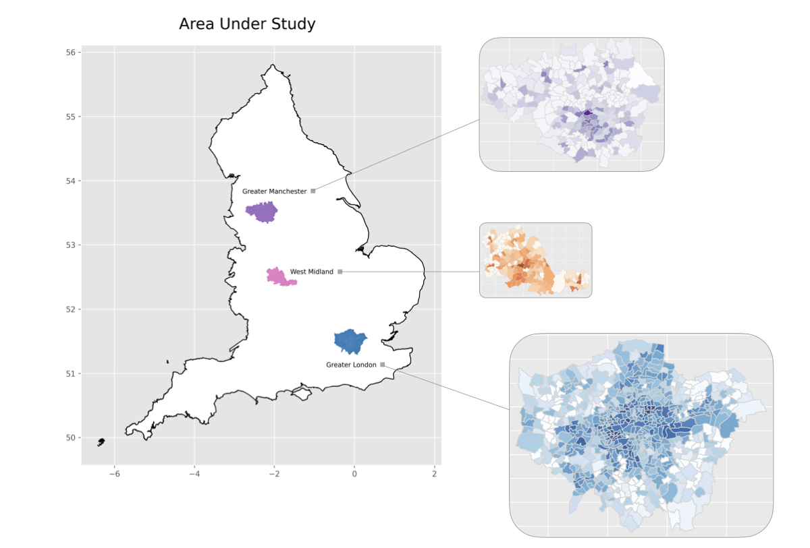
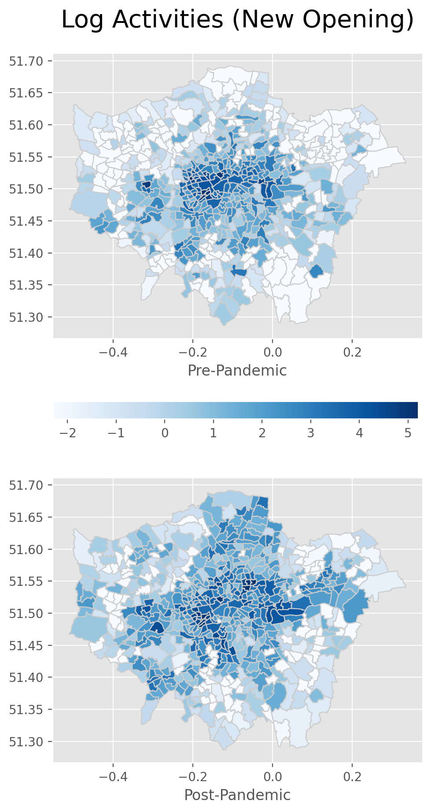
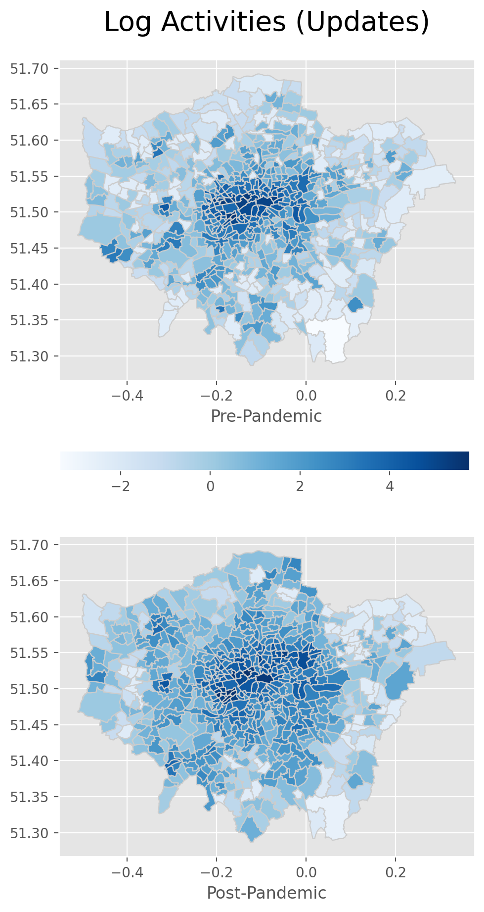
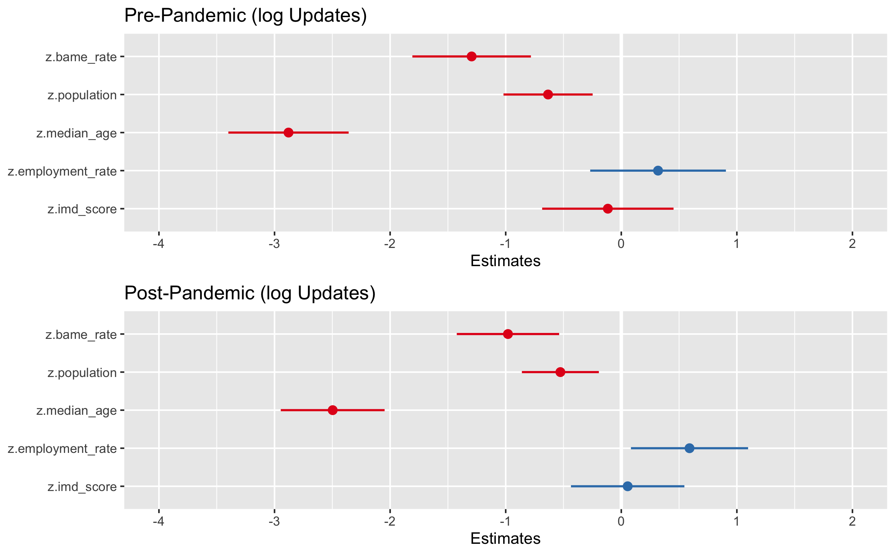
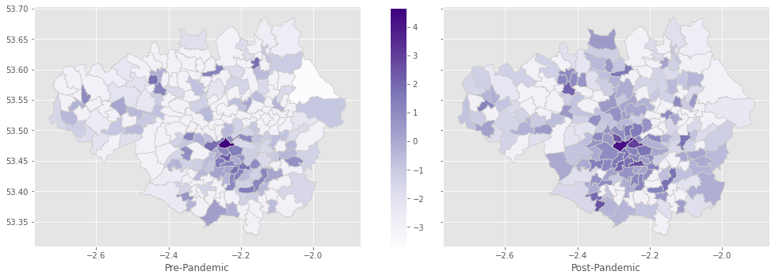
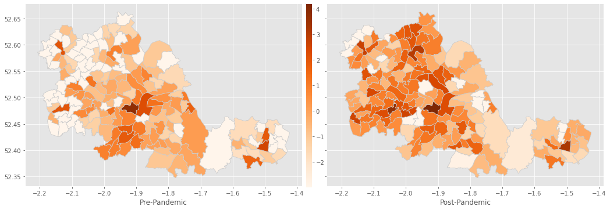
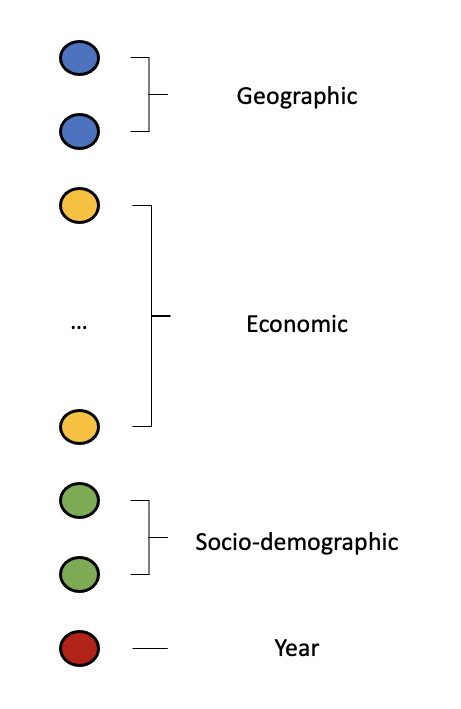
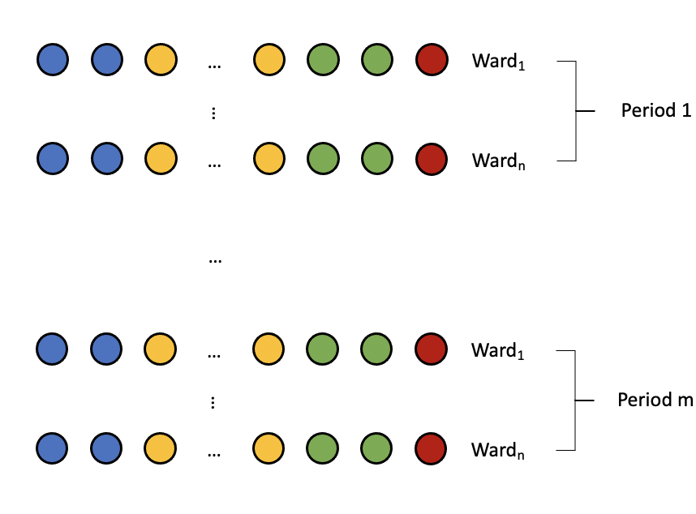

# Modelling-Cities-Development-with-OSM

This repository illustrate the methods for extracting features from OSM database and how to use them to simulate the cities' development from time to time with OpenStreetMap Data. Incorporating the socio-economic variables that describe the cities' profile, we are able to determine the key drivers of cities' developments at different period of time. Further, we can also build models to predict its developments in the futures with the use of predictive modelling. For a high level overview, please check out [Project Summary](/Project Summary.pdf)

  

A case study of how the cities' developments varied before and after COVID-19 is presented:
- First, we have put the ubiquitous corwd-sourced data into meaningful context. In particular, we have shown how to retrieve historical data from OpenStreetMap and proposed a evaluation metric to quantify the undergoing changes within cities. 
- With various source of information incorporated, we then examined the relationship between these changes and the different type of indicators, including geodemographic factors, temporal variable and the surrounding effect. 
- Subsequently, we compared such relationships before and after the outbreak of COVID-19 pandemic and evaluate the difference between the two periods of time, as well as determine the changes across different cities.
- Finally, we extend our idea to real-life application based on the quantified undergoing changes of the city, to predict which area are likely to engage a huge development in the future by using both Cellular Automata model and deep neural network.

   

# Table of contents
1. [Data Processing](#data_processing)
    1. [Data Extraction](#extract)
    2. [Edit History Classification](#classification)
2. [Exploratory Data Analysis](#EDA)
    1. [Overall Trend](#EDA1)
    2. [Spatial Analysis - London](#EDA2)
    3. [Spatial Analysis - Other Regions in th UK](#EDA3)
3. [Predictive Modelling](#statmod)
    1. [Cellular Automata Model](#mod1)
    2. [Deep Neural Network](#mod2)
4. [Conclusion](#conclusion)

---

## Data Processing 
Here are the steps to be followed to do the feature extraction from OpenStreetMap:

### Data Extraction.ipynb 
This workbook retrieve the edit history of POIs from the original document downloaded from OSM. The cleaned data would contain all the edits of POIs lies within the category under study. An example of extracted data can be find below:

  

### Edit History Classification.ipynb 
This workbook then further group the edit history into three types: 1.Updates; 2.Closure and 3.New Opening. Each of these 3 types of edits represent the different type of evolution undergoes within our city and allows us 3 different angles to analyse the development of our cities from time to time.

With the above defined measures, we can count the number of edits for all types within each part of city (e.g. at the level of Ward). This aggragated amount gives us an idea how active the evolution is going on in each part of the city. Further, with the use of other socio-economic factors, we will then be able to model its relationship with the cities' profile. So that, we will be able to determine the key drivers behind the cities' development during each period.

## Exploratory Data Analysis 

### Overall Trend 

  

The above plot shows the one-year snapshots for the monthly aggregated new business opened in London in both Pre- and Post- Pandemic periods.  

- The total amount of new businesses opened in the Post-Pandemic period is greater than the one-year snapshot before the cut-off date (2020-03-31). 
- There is a rebound from June 2020 to September 2020 where the ease of lockdown happened, subsequently, the number drops back as soon as the second wave begin in autumn 2020.

In terms of the trends in these two periods, no big change has been found for new business opening. Thus, we may need to investigate further and at a more granular level in order to see what has been impacted by the COVID-19 crisis.As we are looking into the amenity POIs, which covers 10 sub-categories, we may take a closer look into how each sector has been impacted. 

### Spatial Analysis - London 

  

**Pattern of New Business Openings:**

The above plots shows the pattern of new businesses opened during the one-year interval before and after the outbreak of COVID:

- The new business opened in the one year interval before the outbreak of pandemic mainly concentrated around the built-up areas of Greater London and has only very few spread across the suburbs. 
- New businesses established during the one-year period after the outbreak of pandemic spread more widely across the entire area under study with a quite significant portion in those suburban areas. 

To some extend, this change reflects the increasing demands in various types of facilities and services in the suburbs where some of them were not established locally in the past. 
As before lockdown, commuting is much more convenient and people live in suburbs can access those services that are perhaps only available in the built-up areas easily. 
But now, the restrictions and social scarring have changed this, and thus brought opportunities for these services to be established locally. This also explains why we have seen a increase in the average number of new business (among all amenity types) during the post-pandemic period shown in the plot.

 

**Pattern of Amendments Made on Businesses:**

Now, looking into the variation in measurements of updates shown by the plots, it grants us another angle to analyse the impacts of COVID on cities' evolution. 
- Although the updates have taken place in almost everywhere in London during the one-year timeframe before the crisis started, a very obvious tendency of spreading into non-built-up areas can still be seen in the one-year time after the cut-off point. 
- In fact, not only the coverage has expanded, but also the number of updates increased in the suburbs.There is not doubt that businesses need to have more amendments in response to the restrictions and virus. So, we see more obvious increases of such measurement in the ares surrounding the centre.

For the build-up areas at the centre, the amount of updates stay approximately the same in the two periods. There are two potential reasons why they have the highest amount of updates: 
- They have a larger base (more businesses in operation) compared to other areas. 
- In the past, businesses within these areas may need frequent adjustments potentially due to their commercial strategy or other events that only held in the city centre such as marathon.

However, these events were mostly canceled due to the epidemic, thus the areas has the most concentrated adjustments owing to their large foundations of business and the needs of amendments due to restrictions that applied to all wards.

### Spatial Analysis - Other Regions in th UK 

**Greater Manchester**

  

**West Midland**

  

## Predictive Modelling 

By defining a threshold that indicates the level of activeness for each type of activities, we will then be able to build model that performs classification to find out which part of the city will actively evolve based on the spatial-temporal data we have. Here, we have presented cellular automata model and deep nueral networks as two examples.

### Cellular Automata Model 
The multiple linear regression is easy to implement and interpretable. However, there is a limitation of using this technique when there involves a geographic component. As by Tobler's first law of geography, areas close to one another are more similar than areas that a further away from each other. 

The linear regression model is not able to capture this, substantially due to its assumptions of independence. In order to fix such problem, we need models that cater this property. In this section, we look into one candidate of such models, the **Cellular Automata model**, which is relevant to the context of this thesis. The outline is based on the method proposed in [this paper](https://dl.acm.org/doi/10.1145/2556195.2556244).

### Deep Neural Network 

   

In order to train a multilayer perceptron (MLP) we have organized the data into a set of vectors, each contains all the attributes of an area. Moreover, we have split the data at the yearly level and labels the year for each vector, so that the model can capture more information. The label would simply be the class assigned based on the annual activities. Thus, we have the training input/label ready. Again, as control, we used the records from the same time periods (2012-04-01 to 2019-03-31) for training/validating, and used the same trained neural network for the prediction tasks for both proposed time periods. Since we have 625 of wards and 7-year data, we then have 4375 training inputs in total. 

For the hidden layers, we have experimented with multiple combinations of number of layers/layer sizes, and we found that a 3-layer perceptron gave the best prediction performance whilst we were fine-tuning the learning rate at the same time. Through the experiment, we have found that either too many number of layers/large layer sizes would usually lead to overfitting very quickly. Also, as we only have moderate amount of training inputs, we have set the training epochs to be 30. 

Regarding the output layer, there is only one neuron that generates the predicted class label. Such outputs would therefore be directly comparable to the true labels.

## Conclusion
Overall, we have seen an obvious change in the pattern of cities' developments across all cities under study.

- First, within the Greater London area, the quantified changes before and after the outbreak of pandemic are mostly determined by the geographic, economic and socio-demographic factors. By a thorough evaluation, we have seen a dramatic acceleration of developments in more deprived areas after the outbreak of COVID-19.
- While most of the new openings were concentrated in the built-up areas before the crisis, a significant portion of this is now from those new businesses established in the suburbs.
- With the sizable change in the city's evolution pattern, its dependencies on the past activities decreased significantly after the outbreak of pandemic. In addition, we found that the pace at which changes happen over time are more strongly determined by the influence of surrounding areas after the outbreak of pandemic.

Moreover, we have found that the changes of evolution pattern varied significantly across different locations in the UK. 

- In particular, instead of seeing an obvious expansion of developments in the areas surrounding the built-up ones, we saw a shift of concentration into the northwest from its middle part within West Midlands areas. The pace of developments in its middle (Birmingham) have slowed down significantly after the outbreak of pandemic. On the other hand, the variation of pattern in Greater Manchester is similar to that of Greater London, but much milder. The overall acceleration in development pace is significant in London but only moderate for Greater Manchester.
- For these places, we also attempted to determine whether the quantified changes could be explained by associated attributes in both periods. A dramatic decrease in these attributes' abilities of explaining the undergoing changes were found in Greater Manchester and West Midlands, while it remained stable in the Greater London area. These places with very different culture, history and demography have encountered impacts at different level of severity.

Finally, we extend our idea to predict which area are likely to engage a big evolution in the future. In particular, we have evaluated the performance of both Cellular Automata model and neural network. With limited number of associated attributes, the deep neural network encountered overfitting problem easily, where small true positive rate and perfect true negative rate were returned. On the other hand, the Cellular Automata model gave moderate results in terms of both the true positive and true negative rates, where stepwise regression were used for variable selection. Overall, the Cellular Automata would be a more reliable choice if one would like solve the above specified prediction task in order to make future planning.
