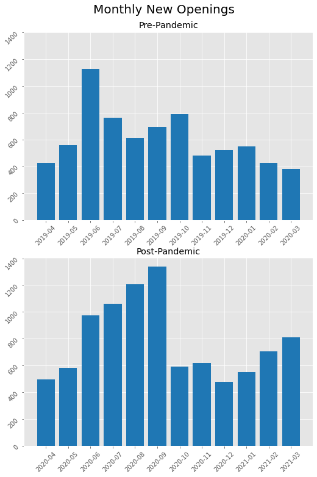
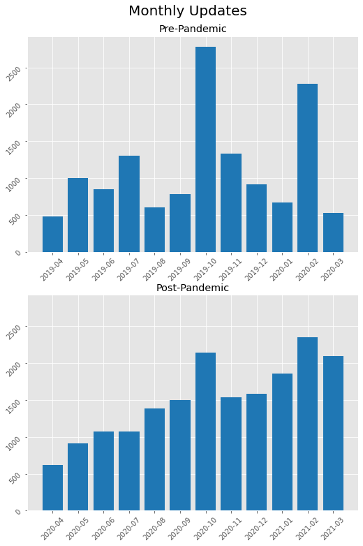

# Modelling-Cities-Development-with-OSM
This repository illustrate the methods for extracting features from OSM database and how to use them to simulate the cities' development from time to time with OpenStreetMap Data.

# Table of contents
1. [Data Processing](#data_processing)
    1. [Data Extraction](#extract)
    2. [Edit History Classification](#classification)
2. [Exploratory Data Analysis](#EDA)
    1. [Overall Trend](#EDA1)
    2. [Spatial Analysis](#EDA2)
3. [Statistical Modelling](#statmod)
    1. [Cellular Automata Model](#mod1)
    2. [Deep Neural Network](#mod2)

---

## Data Processing 
Here are the steps to be followed to do the feature extraction from OpenStreetMap:

### Data Extraction.ipynb 
This workbook retrieve the edit history of POIs from the original document downloaded from OSM. The cleaned data would contain all the edits of POIs lies within the category under study.

### Edit History Classification.ipynb 
This workbook then further group the edit history into three types: 1.Updates; 2.Closure and 3.New. Each of these 3 types of edits represent the different type of evolution undergoes within our city and allows us 3 different angles to analyse the development of our cities from time to time.

## Exploratory Data Analysis 

### Overall Trend 
 

### Spatial Analysis 

## Statistical Modelling 

### Cellular Automata Model 

### Deep Neural Network 
